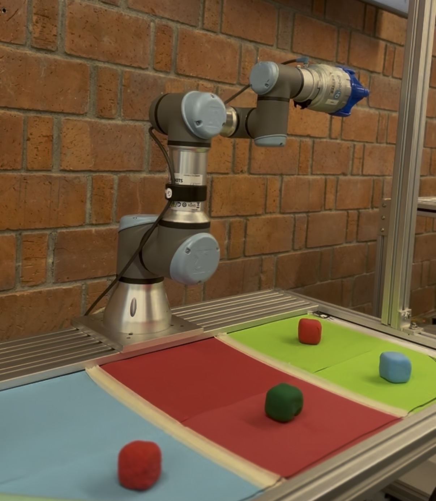
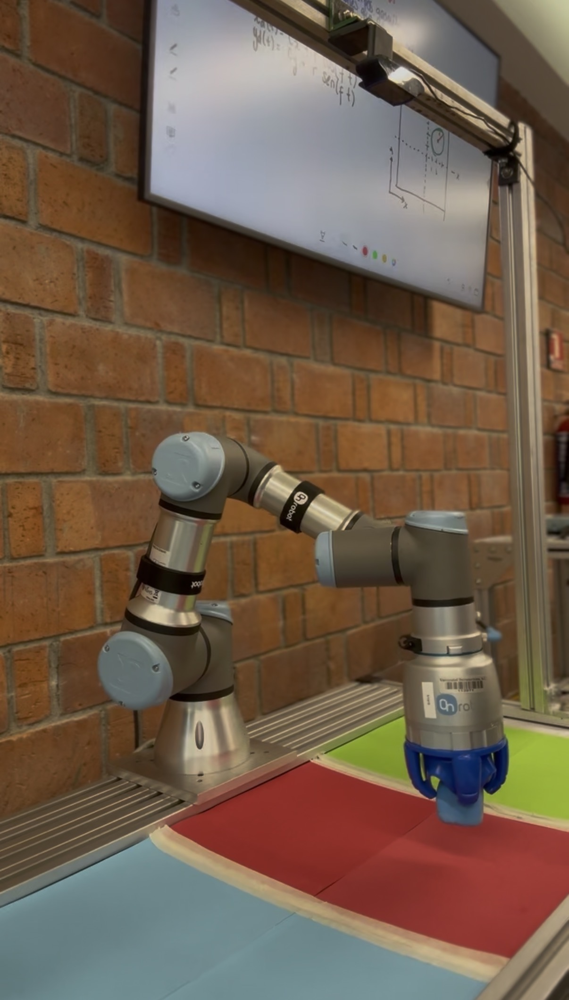

# CoBot Manipulador Clasificador de Colores
{: .no_toc }

**Visión Artificial + Cinemática Inversa Analítica con UR3 de 6 GDL**
{: .fs-5 .fw-300 }

---

<div class="reconocimiento-banner">
  <span class="trofeo">🥉</span>
  <h2>3er Lugar — Día de las Ingenierías 2026</h2>
  <p>Prototipo funcional: <strong>Robot babas</strong></p>
  <p>Universidad Iberoamericana Ciudad de México · 5 de mayo de 2026</p>
  <p style="font-size: 0.85rem; margin-top: 0.5rem;">Firmado por Dr. Andrés Guillermo Molano Jiménez · Mtro. Guillermo Gómez Abascal</p>
</div>

---

## Información del Proyecto
{: .no_toc }

| Campo | Detalle |
|---|---|
| **Estudiante** | Elias Santiago Jiménez Hernández |
| **Carrera** | Ingeniería Mecatrónica · 8° Semestre |
| **Materia** | Control Avanzado |
| **Profesores** | Dr. Andrés Guillermo Molano Jiménez · Dr. Julio Antonio Caballero Mora |
| **Año** | Primavera 2026 |
| **Institución** | Universidad Iberoamericana (IBERO) · Ciudad de México |
| **Robot** | Universal Robots UR3 — 6 GDL |
| **Reconocimiento** | 🥉 3er Lugar · Día de las Ingenierías 2026 |

---

## El Sistema en Acción


*UR3 sobre el área de trabajo con cubos rojo, verde y azul en la zona de clasificación*


*OnRobot Soft Gripper ejecutando la secuencia de agarre (PICK) sobre la zona de destino*

---

## Resumen del Sistema

El **CoBot Clasificador de Colores** es un sistema autónomo de *pick and place* que integra visión artificial por computadora con cinemática inversa analítica para clasificar cubos de colores (rojo, verde, azul) dispersos en un área de trabajo de **920 × 420 mm**.

Una cámara **Logitech C920** montada en configuración *top-down* captura el escenario en tiempo real. Un pipeline OpenCV basado en segmentación HSV y homografía ArUco convierte píxeles en coordenadas cartesianas del robot con precisión < 2 mm. El controlador calcula la configuración articular del UR3 mediante cinemática inversa analítica en < 1 ms, envía comandos `movej` directamente al **puerto TCP 30002** del robot, y controla un gripper neumático OnRobot vía **HTTP REST**, completando ciclos de clasificación sin intervención humana en el modo **SORT**.

El proyecto fue reconocido con el **3er lugar en el Día de las Ingenierías 2026** de la IBERO, en la categoría de prototipo funcional.

---

## Arquitectura del Software

```
main.py  (menú GO / SORT / SORT-BUCLE)
   │
   ├── calibrar_homografia.py   → ArUco → matriz H → caché JSON
   ├── camera_detector.py       → hilo de detección HSV (30 fps)
   │        └── set_homografia(H)   ← inyectada desde main
   ├── inverse_kinematics.py    → IK analítica + cascada de fallback
   │        └── ik_numerica.py  → Levenberg-Marquardt (fallback)
   ├── robot_controller.py      → TCP:30002 + OnRobot HTTP REST
   │        └── trajectory_planner.py → polinomio quíntico
   └── zone_manager.py          → slots libres por zona de color
```

---

## Tecnologías Utilizadas

| Tecnología | Versión | Rol |
|---|---|---|
| **Python** | 3.10+ | Orquestador principal y lógica de control |
| **OpenCV** | 4.x | Captura, segmentación HSV, ArUco, homografía |
| **NumPy** | 1.24+ | Álgebra matricial, DH, Jacobiano, polinomios |
| **Socket TCP** | Puerto 30002 | Comandos URScript directos al UR3 |
| **HTTP REST** | OnRobot API | Control del gripper: grip / release |
| **ArUco Markers** | `cv2.aruco` DICT_4X4_50 | Calibración de homografía cámara→robot |
| **Threading** | `threading` | Detección visual en hilo separado al control |
| **JSON** | stdlib | Caché de homografía calibrada |

---

## Contenido de la Documentación

1. [Introducción y Hardware](01-introduccion) — Contexto, hardware y objetivos
2. [Cinemática Directa](02-cinematica-directa) — Parámetros DH reales del UR3
3. [Control Cinemático](03-control-cinematico) — Jacobiano y control proporcional
4. [Cinemática Inversa](04-cinematica-inversa) — Método analítico y Levenberg-Marquardt
5. [Implementación Industrial](05-implementacion-industrial) — Flujo GO, SORT y comunicación TCP
6. [Visión Artificial](06-vision-artificial) — Pipeline HSV, ArUco y homografía
7. [Resultados](07-resultados) — Métricas, pruebas y conclusiones
8. [Código Fuente](08-codigo-fuente) — Descripción de los módulos reales
9. [Reconocimiento](reconocimiento) — 3er Lugar Día de las Ingenierías 2026

---

[Comenzar: Introducción →](01-introduccion){: .btn .btn-primary .fs-5 .mb-4 .mr-2 }
[Ver reconocimiento 🥉](reconocimiento){: .btn .btn-outline .fs-5 .mb-4 }
